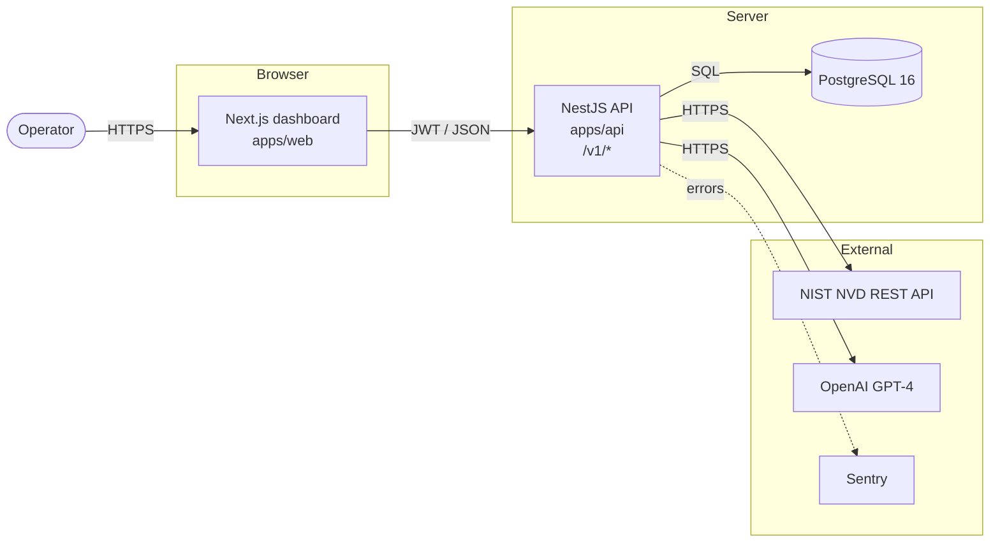
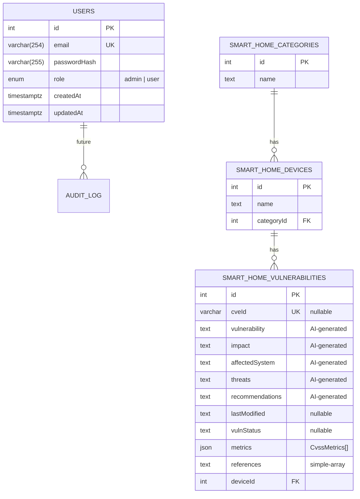
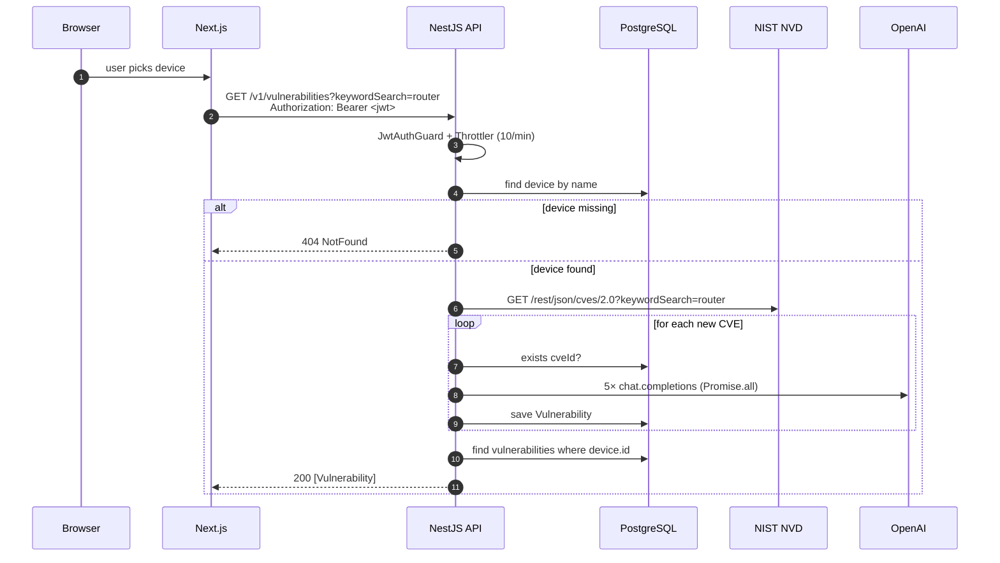
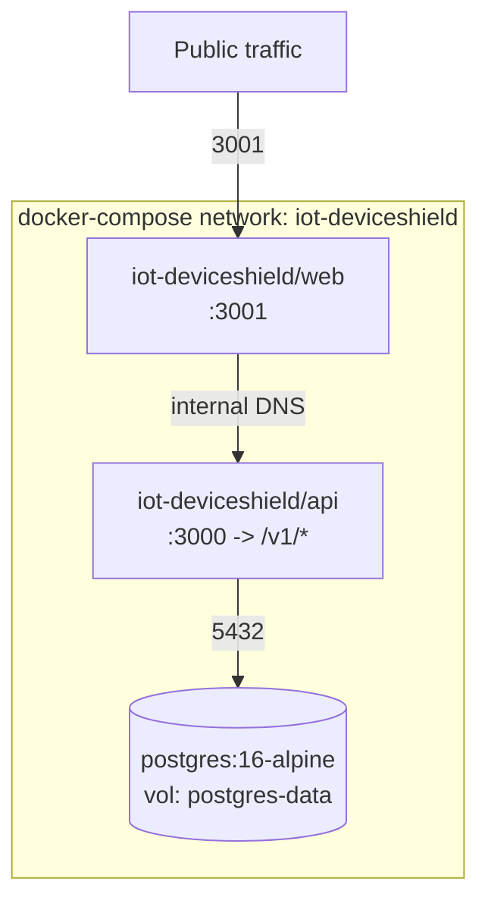

# Architecture

## System overview

IoT-DeviceShield is a two-tier application that catalogs smart-home devices, correlates them with CVEs from NIST's National Vulnerability Database, and generates AI-assisted threat / impact / remediation guidance per finding.



- **Web** issues browser fetches to the API; it holds a JWT in memory after login.
- **API** owns all business logic — auth, device inventory, CVE ingestion, AI orchestration, persistence.
- Shared **`@iot-deviceshield/types`** package holds the interfaces both tiers agree on.

## Repository layout

```text
iot-deviceshield/
├── apps/
│   ├── api/            NestJS 10 + TypeORM + PostgreSQL
│   └── web/            Next.js 14 App Router + MUI
├── packages/
│   ├── types/          Shared DTOs & domain interfaces
│   ├── tsconfig/       Strict base + Nest/Next presets
│   └── eslint-config/  Shared lint rules
├── infra/
│   └── docker/         docker-compose for local dev
├── docs/               Architecture, setup, API reference
└── .github/
    ├── workflows/      CI (lint/test/audit/SAST/scan)
    └── dependabot.yml
```

## Data model



- All foreign keys cascade on delete.
- `USERS.email` is stored lower-cased and uniquely indexed.
- `SMART_HOME_VULNERABILITIES.cveId` is unique; ingestion skips CVEs already present for a device.

## Request flow — `GET /v1/vulnerabilities?keywordSearch=<device>`



- Every request gets an `x-request-id` (correlated in logs).
- 5xx errors are captured to Sentry when `SENTRY_DSN` is set.
- The `strict` throttler on `/v1/vulnerabilities` (10 requests/minute) is deliberate — the endpoint fans out to 5 OpenAI calls per new CVE and is the most expensive path in the system.

## Runtime topology (containerized)



Both containers run as non-root (`app` user), with `no-new-privileges` and `cap_drop: ALL` set in Compose. Health probes hit `/v1/health` (API) and `/` (web). Postgres uses `pg_isready` for its healthcheck; API `depends_on` postgres with `condition: service_healthy`.

## Tooling & DX

| Concern         | Choice                       | Notes                                                                                         |
| --------------- | ---------------------------- | --------------------------------------------------------------------------------------------- |
| Package manager | **pnpm 9**                   | Fast, disk-efficient; strict about peer deps.                                                 |
| Monorepo runner | **Turborepo**                | `^build` graph ensures `packages/types` builds before consumers.                              |
| Language        | TypeScript 5, `strict: true` | See [`packages/tsconfig/base.json`](../packages/tsconfig/base.json).                          |
| API framework   | NestJS 10                    | Modules, DI, class-validator DTOs.                                                            |
| ORM             | TypeORM 0.3                  | Migrations checked in under `apps/api/src/migrations`.                                        |
| Auth            | JWT (Passport) + argon2id    | `JwtAuthGuard`, `RolesGuard`, `@Roles()` decorator.                                           |
| Rate limiting   | `@nestjs/throttler`          | Global 100/min, strict 10/min on vulnerabilities, 20/min on auth.                             |
| Logging         | `nestjs-pino`                | Structured JSON in prod, pretty in dev. Redacts auth headers and passwords.                   |
| Errors          | Global `AllExceptionsFilter` | Sanitizes 5xx, forwards to Sentry.                                                            |
| Frontend        | Next.js 14 App Router        | `output: 'standalone'` for Docker image.                                                      |
| UI              | Material UI 6                | CSS Modules for layout.                                                                       |
| CI              | GitHub Actions               | Lint / typecheck / test / `pnpm audit` / **Semgrep** / **Gitleaks** / **CodeQL** / **Trivy**. |
| Dep updates     | Dependabot                   | Weekly, grouped by ecosystem.                                                                 |

## Security posture

Enforced at code and pipeline levels:

- **Env validation on boot** ([env.schema.ts](../apps/api/src/config/env.schema.ts)) — missing `JWT_SECRET` (min 32 chars), `OPENAI_API_KEY`, or DB creds → the process exits with a diff-style error.
- **CORS** restricted to `FRONTEND_URL`.
- **Helmet** for standard response headers (X-Frame-Options, HSTS, CSP defaults, etc.).
- **Password storage** via `argon2id` (`argon2.hash` with default OWASP-recommended params).
- **JWT** signed with an operator-supplied secret; expiry via `JWT_EXPIRES_IN`.
- **Guards** on every mutating endpoint (`POST/DELETE /v1/{category,devices}` require `admin`).
- **Rate limits** protect the expensive AI path.
- **`synchronize: true`** only in non-production; prod uses TypeORM migrations.
- **`pnpm audit`, Semgrep, Gitleaks, CodeQL, Trivy** run on every PR and merge.
- **Non-root containers**, `cap_drop: ALL`, `no-new-privileges`.
- **Full [SECURITY.md](../SECURITY.md)** covers threat model and disclosure.

## Extension points

- **Add another AI provider** → replace `openAI.chat.completions.create` with a small `AiProvider` interface behind DI; keep the existing 5-prompt structure.
- **Multi-tenant** → add `organizationId` to `User`, `Category`, `Device`; scope every query in the services. Migration required.
- **CVE severity email digest** → new `AlertsModule` with a cron job (`@nestjs/schedule`) that queries `Vulnerability` by severity and dispatches to a mail provider.
- **Non-Postgres deployments** → the TypeORM datasource is the only place that knows the driver; swapping is a config change plus a fresh migration set.
