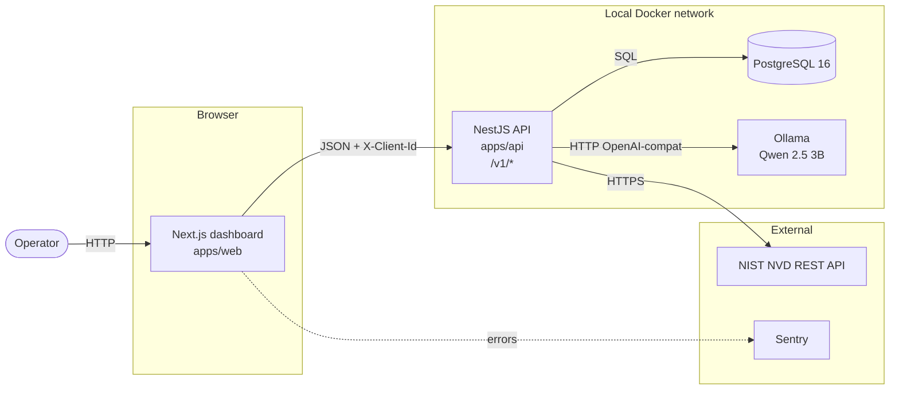
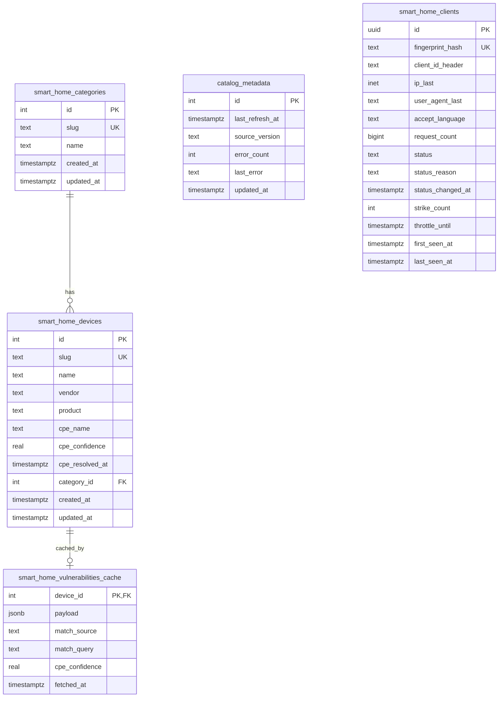
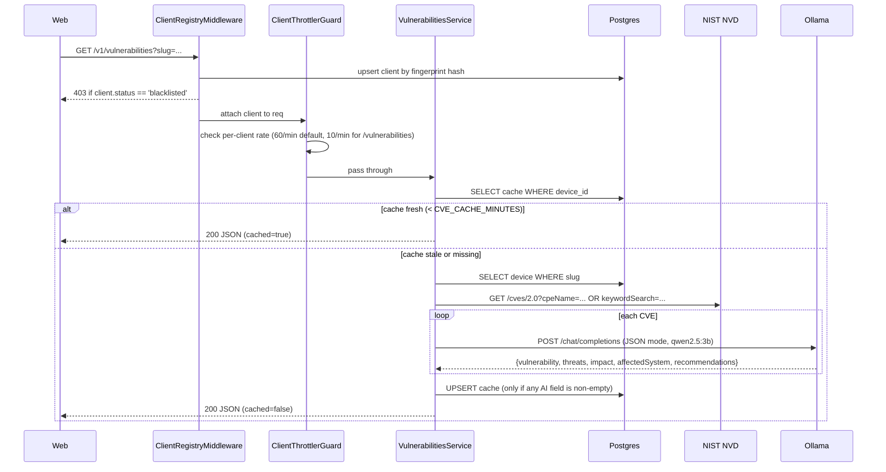

# Architecture

## System overview

IoT-DeviceShield is a two-tier application that catalogs smart-home devices, correlates them with CVEs from NIST's National Vulnerability Database, and adds a plain-language summary to each finding using a locally-hosted LLM.

Nothing about the AI enrichment leaves your network. The language model runs in a Docker container alongside the API.



- **Web** issues browser fetches to the API and attaches a persistent `X-Client-Id` UUID from `localStorage` to every request. No login screen.
- **API** owns all business logic: catalog sync, CVE lookup, AI enrichment, caching, client fingerprinting, rate limiting.
- **Ollama** exposes an OpenAI-compatible chat completions endpoint. The API talks to it via the standard `openai` npm client with a redirected `baseURL`.
- **Shared packages** (`@iot-deviceshield/types`, `@iot-deviceshield/catalog`) hold DTOs and the curated device catalog.

## Repository layout

```text
iot-deviceshield/
├── apps/
│   ├── api/            # NestJS 11 + TypeORM + PostgreSQL
│   └── web/            # Next.js 15 App Router + React 19 + MUI 6
├── packages/
│   ├── types/          # Shared DTOs used by both tiers
│   ├── catalog/        # Curated device catalog (JSON + Zod schema)
│   ├── tsconfig/       # Shared TSConfig presets
│   └── eslint-config/  # Shared ESLint config
├── infra/
│   └── docker/         # docker-compose.yml
├── docs/               # Architecture, setup, security
└── .github/workflows/  # CI: lint, typecheck, test, security scans
```

## Data model



Notes:

- `smart_home_vulnerabilities_cache` stores the fully-enriched response as a JSONB blob. This trades normalization for simplicity: the API always reads/writes the whole record for a device.
- `smart_home_clients` grows one row per unique request fingerprint. In a large deployment you'd want a cleanup job for rows that haven't been seen in N days; that's not implemented.

## Request flow: `GET /v1/vulnerabilities?slug=<slug>`



Behavioral details:

- If NIST is unreachable and a stale cache row exists, the API serves the stale copy and logs a warning. Better than a 5xx.
- If the LLM returns empty AI fields for every CVE (rare — usually a startup race where the model isn't loaded yet), the response is still returned but not written to cache. The next request retries the enrichment.
- CPE resolution runs off the request path in `CatalogSyncService`. When resolution succeeds with confidence ≥ 0.5, the vulnerabilities service queries NIST by `cpeName` (precise match). Otherwise it falls back to `keywordSearch` and the UI shows an "approximate match" badge.

## Startup sequence

Docker Compose brings up postgres, ollama, ollama-model-pull (sidecar), api, and web. The sidecar pulls the model tag if not already present, then exits. The API `depends_on` the sidecar's `service_completed_successfully`, guaranteeing the model exists before the API starts calling for it.

At API boot:

1. TypeORM connects and runs migrations.
2. `CatalogSyncService.onApplicationBootstrap()` reads `packages/catalog/src/catalog.json`, upserts categories and devices, then loops through devices whose CPE isn't resolved (or is stale) and queries NIST's CPE dictionary. This takes 5–15 seconds on a fresh boot.
3. NestJS starts accepting requests.

## Security posture

The security model matches the fact that this is a personal / research project running locally, not a hosted multi-tenant service.

- No user auth. Every unauthenticated request is fingerprint-registered so the throttler can apply per-client limits and a manual block-list.
- Admin surface (catalog refresh, blocklist management) is gated by a static bearer token (`ADMIN_API_TOKEN`) compared with `timingSafeEqual`.
- Helmet + CORS restricted to `FRONTEND_URL`.
- Nest global exception filter sanitizes error responses; stack traces never leak to clients.
- Structured JSON logs via `nestjs-pino` with a redact list for the usual sensitive headers.
- Non-root container users, `no-new-privileges`, and `cap_drop: ALL` in `docker-compose.yml`.
- Sentry on the web (opt-in via DSN). Nothing on the API by default because the interesting failure modes surface in logs.

## Trade-offs and things that were deliberately not built

- **No login.** Adding auth would let us do per-user quotas and personalization, but the product is a lookup tool for a curated catalog. There's nothing to personalize.
- **The AI enrichment cache is coarse (per device, not per CVE).** A device is refreshed or not. Refreshing one CVE independently would be more efficient but adds complexity that's not warranted at this scale.
- **CPE scoring is heuristic** (vendor + product token match, prefer `part=h` for hardware, 0–1 confidence). Good enough to distinguish "clean hit" from "noise". A better system would use NIST's exact-match CPE lookup on a canonical device identifier if we had one.
- **Sequential CVE enrichment.** With a hosted LLM you'd fan out to N parallel calls with backoff. With a local Ollama server, the model is a shared single-process resource, so parallel calls don't help; sequential is honest.
- **No user management / no data export / no scheduled reports.** The scope is "look up devices; see enriched CVEs".

## Where to extend

- **Different device catalog.** Edit `packages/catalog/src/catalog.json`. The Zod schema validates on load. New devices trigger a CPE resolution on next sync.
- **Different LLM.** Change `OLLAMA_MODEL`. Any Ollama-supported chat model with reasonable JSON-following will work.
- **Different LLM provider.** `AiAssistantService` is a thin wrapper around the `openai` client with a redirected `baseURL`. Point at any OpenAI-compatible endpoint (LM Studio, vLLM, hosted providers) by changing `OLLAMA_HOST`.
- **Persistent audit log for admin actions.** Currently the client blacklist stores a `status_reason` but not a full audit trail. Adding a small `admin_events` table would be a 30-minute change.
